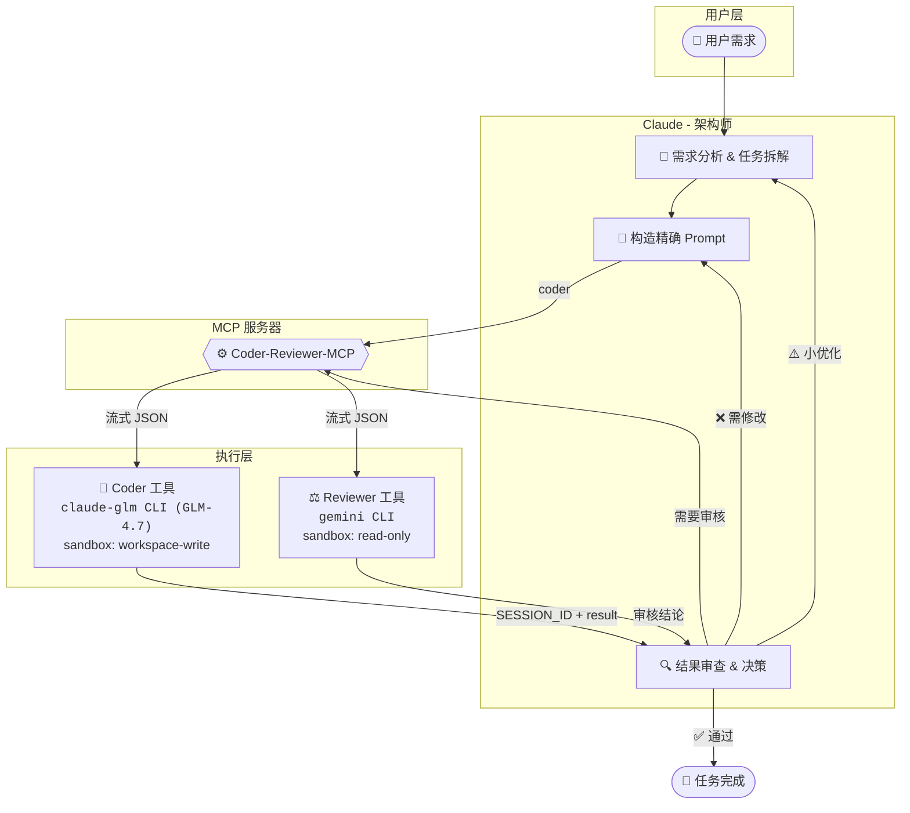

# Coder-Reviewer-MCP

<div align="center">


[English Docs](README_EN.md)

**Claude + Coder (claude-glm/GLM-4.7) + Reviewer (Gemini) 多模型协作框架**

让 **Claude (Opus)** 作为架构师调度 **Coder (claude-glm/GLM-4.7)** 执行代码任务、**Reviewer (Gemini)** 审核代码质量，<br>形成**自动化的多方协作闭环**。

[快速开始](#-快速开始) • [核心特性](#-核心特性) • [架构说明](#-架构说明) • [工具详解](#️-工具详解) • [安装指南](#-安装指南)

</div>

---

## 🌟 核心特性

Coder-Reviewer-MCP 通过连接多个顶级模型，构建了一个高效、低成本且高质量的代码生成与审核流水线：

| 维度 | 价值说明 |
| :--- | :--- |
| **🧠 成本优化** | **Claude (Opus)** 负责高智商思考与调度（贵但强），**Coder (claude-glm/GLM-4.7)** 负责繁重的代码执行（量大管饱）。 |
| **🧩 能力互补** | **Claude** 补足 **Coder** 的创造力短板，**Reviewer (Gemini)** 提供独立的第三方审核视角。 |
| **🛡️ 质量保障** | 引入独立审核机制：**Reviewer (Gemini)** 提供客观的 Code Review，确保代码健壮性。 |
| **🔄 全自动闭环** | 支持 `拆解` → `执行` → `审核` → `重试` 的全自动流程，最大程度减少人工干预。 |
| **🔄 上下文保持** | **SESSION_ID** 会话复用机制确保多轮协作上下文连贯，支持长任务稳定执行，无信息丢失。 |

## 🤖 角色分工与协作

在这个体系中，每个模型都有明确的职责：

*   **Claude (Opus)**: 👑 **架构师 / 协调者**
    *   负责需求分析、任务拆解、Prompt 优化以及最终决策。
*   **Coder (claude-glm/GLM-4.7)**: 🔨 **执行者**
    *   负责具体的代码生成、修改、批量任务处理。
    *   使用 claude-glm CLI 封装的 GLM-4.7 模型，成本低、执行力强。
*   **Reviewer (Gemini)**: ⚖️ **审核官 / 代码顾问**
    *   负责独立的代码质量把关，提供客观的 Code Review。
    *   使用 Google Gemini CLI 进行代码审核。

### 📊 实测案例

**[单元测试批量生成](cases/2025-01-05-unit-test-generation/README.md)** - CCG 架构实测记录

| 指标 | 纯 Claude 方案 | CCG 协作方案 | 说明 |
| :--- | :--- | :--- | :--- |
| **任务规模** | 7,488 行代码（481 个测试用例） | 7,488 行代码（481 个测试用例） | 为某后端项目生成单元测试 |
| **总成本** | $3.13 | $0.55 | **节省 82%** |
| **Claude 成本** | $3.13 | $0.29 | **节省 91%**（仅架构调度） |
| **Coder 成本** | $0 | $0.26 | 执行繁重代码生成任务 |
| **质量审核** | ❌ 无独立审核 | ✅ Reviewer (Gemini) 终审 | 独立把关，代码质量可控 |

**核心优势**：
- 💰 **成本优化**：Claude 只输出简短指令，利用便宜的输入价格处理验收工作，避免输出昂贵的代码 token
- 🔄 **上下文保持**：SESSION_ID 会话复用机制确保多轮协作上下文连贯，支持长任务稳定执行
- ⚡ **长任务稳定性**：优化的任务拆分与重试策略，确保大型任务（如批量生成 7,488 行测试代码）稳定完成
- 🛡️ **质量保障**：Reviewer (Gemini) 独立审核机制，代码质量可控

### 协作流程图



**典型工作流**：

```
1. 用户提出需求
       ↓
2. Claude 分析、拆解任务，构造精确 Prompt
       ↓
3. 调用 coder 工具 → 执行代码生成/修改
       ↓
4. Claude 审查结果，决定是否需要 Reviewer 审核
       ↓
5. 调用 reviewer 工具 → 独立 Code Review
       ↓
6. 根据审核结论：通过 / 优化 / 重新执行
```

## 🚀 快速开始

### 1. 前置要求

在开始之前，请确保您已安装以下工具：

*   **uv**: 极速 Python 包管理器 ([安装指南](https://docs.astral.sh/uv/))
    *   Windows: `powershell -c "irm https://astral.sh/uv/install.ps1 | iex"`
    *   macOS/Linux: `curl -LsSf https://astral.sh/uv/install.sh | sh`
*   **Claude Code**: 版本 **≥ v2.0.56** ([安装指南](https://code.claude.com/docs))
*   **claude-glm CLI**: 使用 GLM-4.7 后端的 Claude Code 兼容 CLI（需自行配置）
*   **Gemini CLI**: 代码审核工具 ([安装指南](https://github.com/google-gemini/gemini-cli))
*   **GLM-4.7 API Token**: 从 [智谱 AI](https://open.bigmodel.cn) 获取

> **⚠️ 重要提示：费用与权限**
> *   **工具授权**：`claude-glm` 和 `gemini` CLI 工具均需在本地完成登录授权。
> *   **费用说明**：这些工具的使用通常涉及官方订阅费用或 API 使用费。
>     *   **Claude Code**: 需要 Anthropic 账号及相应的计费设置。（或三方接入）
>     *   **Gemini CLI**: 可能涉及 Google AI 订阅或 API 调用限制。
>     *   **claude-glm (GLM-4.7)**: 需自行承担智谱 AI 的 API 调用费用。
> *   请在正式使用前确保所有工具已登录且账号资源充足。

### ⚡ 一键配置（推荐）

我们提供一键配置脚本，自动完成所有设置步骤：

**Windows（双击运行或终端执行）**
```powershell
git clone https://github.com/KK1aus/Coder-Codex-Gemini.git
cd Coder-Codex-Gemini
.\setup.bat
```

**macOS/Linux**
```bash
git clone https://github.com/KK1aus/Coder-Codex-Gemini.git
cd Coder-Codex-Gemini
chmod +x setup.sh && ./setup.sh
```

**脚本执行流程**：

1. **检查并安装 uv** - 如未安装则自动下载安装
2. **检查 claude-glm CLI** - 验证是否已安装
3. **安装项目依赖** - 运行 `uv sync`
4. **注册 MCP 服务器** - 自动配置到用户级别
5. **安装 Skills** - 复制工作流指导到 `~/.claude/skills/`
6. **配置全局 Prompt** - 自动追加到 `~/.claude/CLAUDE.md`

> 💡 **提示**：一键配置完成后，请重启 Claude Code CLI 使配置生效。

### Windows 用户注意事项

在 Windows 上使用 Coder-Reviewer-MCP，请确保以下 CLI 工具已正确添加到系统 PATH：

| 工具 | 验证命令 | 说明 |
|------|----------|------|
| `claude-glm` | `where claude-glm` | 需自行安装配置 |
| `gemini` | `where gemini` | 通过 npm 全局安装 |
| `uv` | `where uv` | `%USERPROFILE%\.local\bin\uv.exe` |

**验证安装**：
```powershell
# 检查所有工具是否可用
claude-glm --version
gemini --version
uv --version
```

### 2. 安装 MCP 服务器

#### 远程安装（推荐）

一键脚本默认使用远程安装方式，无需额外操作。如需手动安装：

```bash
claude mcp add ccg -s user --transport stdio -- uvx --refresh --from git+https://github.com/KK1aus/Coder-Codex-Gemini.git ccg-mcp
```

#### 本地安装（仅开发调试）

如需修改源码或调试，可使用本地安装：

```bash
# 进入项目目录
cd /path/to/Coder-Codex-Gemini

# 安装依赖
uv sync

# 注册 MCP 服务器（使用本地路径）
# Windows
claude mcp add ccg -s user --transport stdio -- uv run --directory $pwd ccg-mcp

# macOS/Linux
claude mcp add ccg -s user --transport stdio -- uv run --directory $(pwd) ccg-mcp
```

**卸载 MCP 服务器**
```bash
claude mcp remove ccg -s user
```

### 3. 配置 claude-glm

推荐使用 **配置文件** 方式进行管理。

**创建配置目录**:
```bash
# Windows
mkdir %USERPROFILE%\.claude-glm

# macOS/Linux
mkdir -p ~/.claude-glm
```

**创建配置文件** `~/.claude-glm/config.toml`:
```toml
[general]
api_token = "your-api-token"  # 必填，从智谱 AI 获取
base_url = "https://open.bigmodel.cn/api/anthropic"
model = "glm-4.7"
```

### 4. 安装 Skills（推荐）

Skills 层提供工作流指导，确保 Claude 正确使用 MCP 工具。

```bash
# Windows (PowerShell)
if (!(Test-Path "$env:USERPROFILE\.claude\skills")) { mkdir "$env:USERPROFILE\.claude\skills" }
xcopy /E /I "skills\ccg-workflow" "$env:USERPROFILE\.claude\skills\ccg-workflow"

# macOS/Linux
mkdir -p ~/.claude/skills
cp -r skills/ccg-workflow ~/.claude/skills/
```

### 5. 配置全局 Prompt（推荐）

在 `~/.claude/CLAUDE.md` 中添加强制规则，确保 Claude 遵守协作流程：

```markdown
# 全局协议

## 强制规则

- **默认协作**：所有代码/文档改动任务，**必须**委托 Coder 执行，阶段性完成后**必须**调用 Reviewer 审核
- **跳过需确认**：若判断无需协作，**必须立即暂停**并报告：
  > "这是一个简单的[描述]任务，我判断无需调用 Coder/Reviewer。是否同意？等待您的确认。"
- **违规即终止**：未经确认跳过 Coder 执行或 Reviewer 审核 = **流程违规**
- **必须会话复用**：必须保存接收到的 `SESSION_ID` ，并始终在请求参数中携带 `SESSION_ID` 保持上下文
- **SESSION_ID 管理规范**：Coder 和 Reviewer 的 SESSION_ID 相互独立，必须使用 MCP 工具响应返回的实际 SESSION_ID 值，严禁自创 ID 或混用

## ⚠️ Skill 阅读前置条件（强制）

**在调用任何 Coder-Reviewer-MCP 工具之前，必须先执行对应的 Skill 获取最佳实践指导：**

| MCP 工具 | 前置 Skill | 执行方式 |
|----------|-----------|---------|
| `mcp__ccg__coder` | `/ccg-workflow` | 必须先执行 |
| `mcp__ccg__reviewer` | `/ccg-workflow` | 必须先执行 |

**执行流程**：
1. 用户请求使用 Coder/Reviewer
2. **立即执行 Skill**（`/ccg-workflow`）
3. 阅读 Skill 返回的指导内容
4. 按照指导调用 MCP 工具

**禁止行为**：
- ❌ 跳过 Skill 直接调用 MCP 工具
- ❌ 假设已了解最佳实践而不执行 Skill

---

# AI 协作体系

**Claude 是最终决策者**，所有 AI 意见仅供参考，需批判性思考后做出最优决策。

## 角色分工

| 角色 | 定位 | 用途 | sandbox | 重试 |
|------|------|------|---------|------|
| **Coder** | 代码执行者 | 生成/修改代码、批量任务 | workspace-write | 默认不重试 |
| **Reviewer** | 代码审核者 | 质量把关、Code Review | read-only | 默认 1 次 |

## 核心流程

1. **Coder 执行**：所有改动任务委托 Coder 处理
2. **Claude 验收**：Coder 完成后快速检查，有误则 Claude 自行修复
3. **Reviewer 审核**：阶段性开发完成后调用 review，有误委托 Coder 修复，持续迭代直至通过

## 任务拆分原则（分发给 Coder）

> ⚠️ **一次调用，一个目标**。禁止向 Coder 堆砌多个不相关需求。

- **精准 Prompt**：目标明确、上下文充分、验收标准清晰
- **按模块拆分**：相关改动可合并，独立模块分开
- **阶段性 Review**：每模块 Claude 验收，里程碑后 Reviewer 审核
```

> **说明**：纯 MCP 也能工作，但推荐 Skills + 全局 Prompt 配置以获得最佳体验。

### 6. 验证安装

运行以下命令检查 MCP 服务器状态：

```bash
claude mcp list
```

✅ 看到以下输出即表示安装成功：
```text
ccg: ... - ✓ Connected
```

### 7. (可选) 权限配置

为获得流畅体验，可在 `~/.claude/settings.json` 中添加自动授权：

```json
{
  "permissions": {
    "allow": [
      "mcp__ccg__coder",
      "mcp__ccg__reviewer"
    ]
  }
}
```

## 🛠️ 工具详解

### `coder` - 代码执行者

调用 claude-glm CLI (GLM-4.7) 执行具体的代码生成或修改任务。

| 参数 | 类型 | 必填 | 默认值 | 说明 |
| :--- | :--- | :---: | :--- | :--- |
| `PROMPT` | string | ✅ | - | 具体的任务指令和代码要求 |
| `cd` | Path | ✅ | - | 目标工作目录 |
| `sandbox` | string | - | `workspace-write` | 沙箱策略，默认允许写入 |
| `SESSION_ID` | string | - | `""` | 会话 ID，用于维持多轮对话上下文 |
| `return_all_messages` | bool | - | `false` | 是否返回完整的对话历史（用于调试） |
| `return_metrics` | bool | - | `false` | 是否在返回值中包含耗时等指标 |
| `timeout` | int | - | `300` | 空闲超时（秒），无输出超过此时间触发超时 |
| `max_duration` | int | - | `1800` | 总时长硬上限（秒），默认 30 分钟，0 表示无限制 |
| `max_retries` | int | - | `0` | 最大重试次数（Coder 默认不重试） |
| `log_metrics` | bool | - | `false` | 是否将指标输出到 stderr |

### `reviewer` - 代码审核者

调用 Gemini CLI 进行独立且严格的代码审查。

| 参数 | 类型 | 必填 | 默认值 | 说明 |
| :--- | :--- | :---: | :--- | :--- |
| `PROMPT` | string | ✅ | - | 审核任务描述 |
| `cd` | Path | ✅ | - | 目标工作目录 |
| `sandbox` | string | - | `read-only` | **强制只读**，严禁审核者修改代码 |
| `SESSION_ID` | string | - | `""` | 会话 ID |
| `skip_git_repo_check` | bool | - | `true` | 是否允许在非 Git 仓库运行 |
| `return_all_messages` | bool | - | `false` | 是否返回完整的对话历史（用于调试） |
| `image` | List[Path]| - | `[]` | 附加图片列表（用于 UI 审查等） |
| `model` | string | - | `""` | 指定模型，默认使用 Gemini 自己的配置 |
| `return_metrics` | bool | - | `false` | 是否在返回值中包含耗时等指标 |
| `timeout` | int | - | `300` | 空闲超时（秒），无输出超过此时间触发超时 |
| `max_duration` | int | - | `1800` | 总时长硬上限（秒），默认 30 分钟，0 表示无限制 |
| `max_retries` | int | - | `1` | 最大重试次数（Reviewer 默认允许 1 次重试） |
| `log_metrics` | bool | - | `false` | 是否将指标输出到 stderr |
| `yolo` | bool | - | `false` | 无需审批运行所有命令（跳过沙箱） |
| `profile` | string | - | `""` | 从 ~/.reviewer/config.toml 加载的配置文件名称 |

### 超时机制

本项目采用**双重超时保护**机制：

| 超时类型 | 参数 | 默认值 | 说明 |
|----------|------|--------|------|
| **空闲超时** | `timeout` | 300s | 无输出超过此时间触发超时，有输出则重置计时器 |
| **总时长硬上限** | `max_duration` | 1800s | 从开始计时，无论是否有输出，超过此时间强制终止 |

**错误类型区分**：
- `idle_timeout`：空闲超时（无输出）
- `timeout`：总时长超时

### 返回值结构

```json
// 成功（启用指标，return_metrics=true）
{
  "success": true,
  "tool": "coder",
  "SESSION_ID": "uuid-string",
  "result": "回复内容",
  "metrics": {
    "ts_start": "2026-01-20T10:00:00.000Z",
    "ts_end": "2026-01-20T10:00:05.123Z",
    "duration_ms": 5123,
    "duration_seconds": 5.123,
    "tool": "coder",
    "sandbox": "workspace-write",
    "success": true,
    "retries": 0,
    "exit_code": 0,
    "prompt_chars": 256,
    "prompt_lines": 10,
    "result_chars": 1024,
    "result_lines": 50,
    "raw_output_lines": 60,
    "json_decode_errors": 0,
    "input_tokens": 305,
    "output_tokens": 64,
    "total_tokens": 369
  }
}

// 失败（结构化错误）
{
  "success": false,
  "tool": "coder",
  "error": "错误摘要",
  "error_kind": "idle_timeout | timeout | upstream_error | ...",
  "error_detail": {
    "message": "错误简述",
    "exit_code": 1,
    "last_lines": ["最后20行输出..."],
    "idle_timeout_s": 300,
    "max_duration_s": 1800
  }
}
```

## 📚 架构说明

### 三层配置架构（Claude Code）

本项目在 Claude Code 环境下采用 **MCP + Skills + 全局 Prompt** 混合架构，各层职责分明：

| 层级 | 职责 | Token 消耗 | 必需性 |
|------|------|-----------|--------|
| **MCP 层** | 工具实现（类型安全、结构化错误、重试、metrics） | 固定（工具 schema） | **必需** |
| **Skills 层** | 工作流指导（触发条件、流程、模板） | 按需加载 | 推荐 |
| **全局 Prompt 层** | 强制规则（确保 Claude 遵守协作流程） | 固定（约 20 行） | 推荐 |

**为什么推荐完整配置？**
- **纯 MCP**：工具可用，但 Claude 可能不理解何时/如何使用
- **+ Skills**：Claude 学会工作流程，知道何时触发协作
- **+ 全局 Prompt**：强制规则确保 Claude 始终遵守协作纪律

**Token 优化**：Skills 按需加载，非代码任务不加载工作流指导，可显著节约 Token

---

## 🧑‍💻 开发与贡献

欢迎提交 Issue 和 Pull Request！

```bash
# 1. 克隆仓库
git clone https://github.com/KK1aus/Coder-Codex-Gemini.git
cd Coder-Codex-Gemini

# 2. 安装依赖 (使用 uv)
uv sync

# 3. 本地调试运行
uv run ccg-mcp
```

## 📚 参考资源

- **FastMCP**: [GitHub](https://github.com/jlowin/fastmcp) - 高效的 MCP 框架
- **GLM API**: [智谱 AI](https://open.bigmodel.cn) - 强大的国产大模型（推荐作为 Coder 后端）
- **Claude Code**: [Documentation](https://docs.anthropic.com/en/docs/claude-code)
- **Gemini CLI**: [GitHub](https://github.com/google-gemini/gemini-cli) - Google Gemini 命令行工具

## 📄 License

MIT
